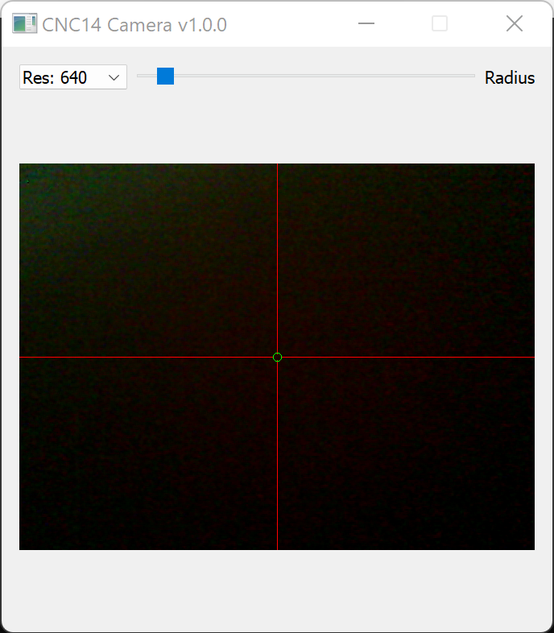
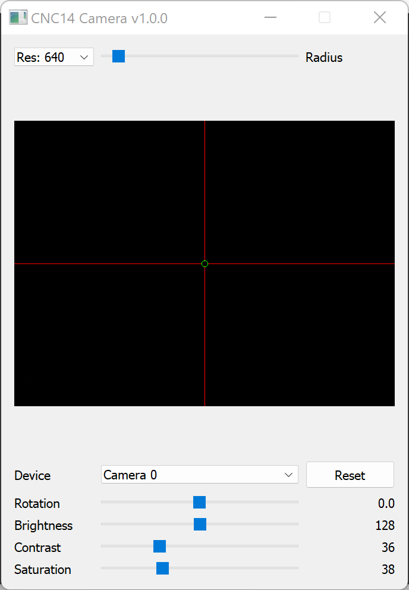

# CNC14Camera
A simple camera tool for the CNC14 machine (or any other CNC machine)

The purpose of this tool is to zero the XY-coordinates of a CNC machine.
It permanently display the image grabbed from a video device, e.g. a camera
plugged into an USB port. The image contains a red cross indicating the X-
and Y-axis of the machine. The center of cross is a green circle, the radius
of which can be adjusted with a slide control next to the resolution
combo-box-button.
By clicking on the image it is possible to setup some parameters which are
used by default. In the first line you can choose the camera device if there
are several ones attached to the computer.
The next line rotates the red cross in order to match the actual X-
and Y-axis of the machine. In addition the camera parameters, like brightness,
contrast and saturation, can be adjusted as well.
All of the slider values as well as the current resolution and the current
device are stored in user's settings.

Prerequisites:
This program is a python3-script using the modules PyQt5,cv2,math,numpy and
platform.

Usage: Just run the python script without any parameters in your favorite way.

Installed python:
Linux: /usr/bin/python3 CNC14Camera.py
Windows: double click on CNC14Camera.py

Single executables:
You may want to have a single executable so that you don't have to take care
about installing python3 and the required modules - especially on computers
using Windows.
You can do this by using PyInstaller on a machine with all of the
prerequisites and PyInstaller (pip install pyinstaller)
1. open command shell
2. create a new directory, e.g. by "mkdir cam_distrib", and copy the python
   script CNC14Camera.py into it
3. change into this directory by "cd cam_distrib"
4. call "PyInstaller --onefile CNC14Camera.py"

Afterwards the single executable is located in the sub-directory "dist". 
It contains a python interpreter and all of the required modules so that
the executable may be run on computers which don't have python installed

NOTE: There have been newer versions of PyInstaller and OpenCV (cv2) which
      are currently incompatible. A known working combination is:
      opencv-python: 4.5.5.64
      pyinstaller: 5.2

      you may check your current version by:
        pip show opencv-python pyinstaller

      if you have newer version installed, you may override them by
        pip install --ignore-installed opencv-python==4.5.5.64
        pip install --ignore-installed pyinstaller=5.2

This procedure works for Windows machines as well as for MacOS machines
and for Linux machines. However, the executables only run on machines
using the same OS - or at least very similar. This means that Linux-
executables build on a specific distribution may not run on a different
Linux distribution.

The bin-directory already contains a compiled single executable for
Windows and MacOS (camera access may be required for terminal).